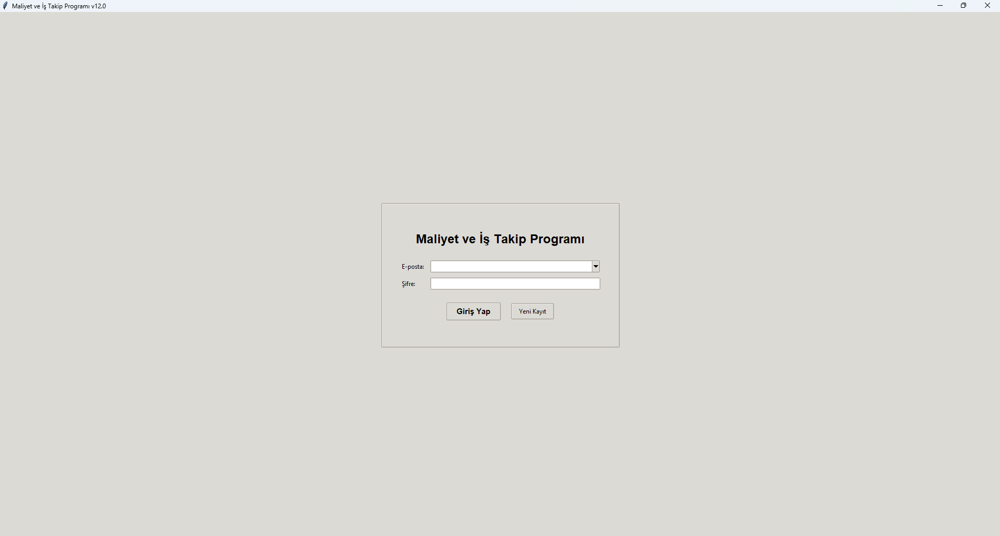
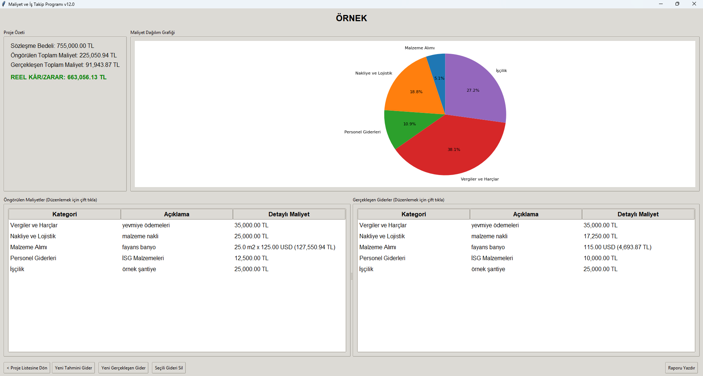

# Maliyet ve İş Takip Programı

**Excel'deki karmaşaya son! Özellikle KOBİ'ler, serbest çalışanlar ve proje bazlı iş yapan profesyoneller için tasarlanmış, basit ve güçlü bir masaüstü maliyet yönetimi çözümü.**

Projelerinizin finansal kontrolünü elinize alın, kârlılığınızı anlık olarak görün ve tek tuşla profesyonel raporlar oluşturun.

---

### 🔥 Temel Özellikler

* **Proje Bazlı Yönetim:** Tüm gelir ve giderlerinizi projelere ayırarak takip edin. Birden fazla işi aynı anda yönetmek hiç bu kadar kolay olmamıştı.
* **Detaylı Gider Takibi:**
    * **Tahmini vs. Gerçekleşen:** Proje başında belirlediğiniz bütçeye ne kadar sadık kaldığınızı görün.
    * **Esnek Gider Tipleri:** Malzeme alımları için "Miktar x Birim Fiyat" veya maaş, kira gibi giderler için "Toplu Tutar" girişi yapın.
    * **Kişiselleştirilebilir Kategoriler:** Giderlerinizi "İşçilik", "Malzeme", "Nakliye" gibi standart veya kendi oluşturduğunuz özel kategorilere ayırın.
* **Anlık Finansal Özet:** Her proje için sözleşme bedelini, toplam maliyeti ve net kârı/zararı anlık olarak görüntüleyin.
* **Görsel Analiz:** Maliyetlerinizin hangi kategorilere dağıldığını pasta grafiği ile bir bakışta anlayın.
* **Tek Tuşla PDF Raporlama:** Projenizin tüm finansal dökümünü saniyeler içinde profesyonel bir PDF raporuna dönüştürün ve paylaşın.

### 🎯 Kimler İçin İdeal?

* İnşaat firmaları ve müteahhitler
* İç mimarlar ve dekorasyon firmaları
* Reklam ajansları ve organizasyon şirketleri
* Yazılım geliştiriciler ve serbest çalışanlar
* Mobilya atölyeleri ve imalatçılar
* Kısacası, proje bazlı çalışan ve kârlılığını takip etmek isteyen herkes!

### 🚀 Dosyalar ve Kullanım

* **Kullanıcı Kılavuzu:** [Maliyet ve İş Takip Programı - Kullanıcı Kılavuzu.pdf](Maliyet%20ve%20İş%20Takip%20Programı%20-%20Kullanıcı%20Kılavuzu.pdf)
* **Örnek Rapor:** [Proje Raporu_örnek.pdf](Proje%20Raporu_örnek.pdf)

Programı kullanmak için `.exe` dosyasını indirip doğrudan çalıştırabilirsiniz. Detaylı bilgi için kullanıcı kılavuzunu inceleyiniz.
